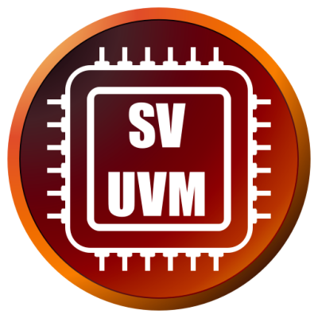
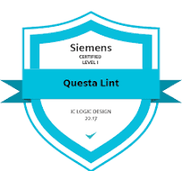
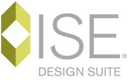
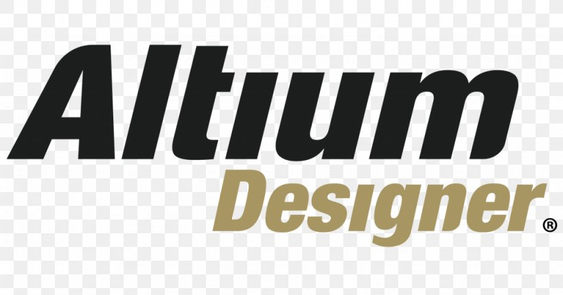
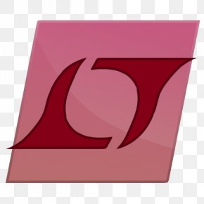

<h1 align="center">Hi, I'm Fares Hegazi </h1>

🚀 Digital IC Design Student | 🎯 Team Leader @ Momentum | ✍️ Content Creator  

---

## <picture></picture> About Me  

<picture> 
  
</picture>

- 🎓 Undergraduate **Communication Engineering Student (ECE)**  
- 💡 Specialized in **Digital IC Design, Verification, and Embedded Systems**  
- 👨‍🏫 Instructor in **Digital Design & Hardware**  
- 🧑‍💼 **Leader of Momentum Student Team** (since 2024)  
- 📝 3+ years of experience as a **Content Creator & Marketing Specialist**  
- ⚡ Passionate about **Chip Design, Hardware Projects, and PCB Design**  
- 📧 Reach me at **fareswaelheagzy@gmail.com**  

---

## 🌐 Connect with Me  

  
  
    
  
  

  

---

## 🛠️ Skills  

### 💻 Languages  

  <code></code>
  <code></code>
  <code></code>
  <code></code>
  <code></code>
  <code></code>
  <code></code>
  <code></code>

  

### ⚙️ Tools & Platforms  

  <code></code>
  <code></code>
  <code></code>
  <code></code>
  <code></code>
  <code></code>
  <code></code>
  <code></code>
  <code></code>
  <code></code>
  <code></code>
  <code></code>
  <code></code>
  <code></code>
  

  

---

## 📊 GitHub Stats

  <!-- Profile Summary Card -->
  

  <!-- Top Languages -->
  

---

## 🏆 Achievements  
- 🏳️ **Momentum's Team Leader** for 2024 - 2025  
- 🥈 **2nd Place RoboSoccer** Competition  
- 🤝 Led **partnerships & marketing campaigns** (e.g. Barq, The Stage, Momentum collaborations)  
- 🎤 Instructor in **IC Design & Hardware Trainings**  

---

<h3 align="center">👀 Profile Views</h3>

  

